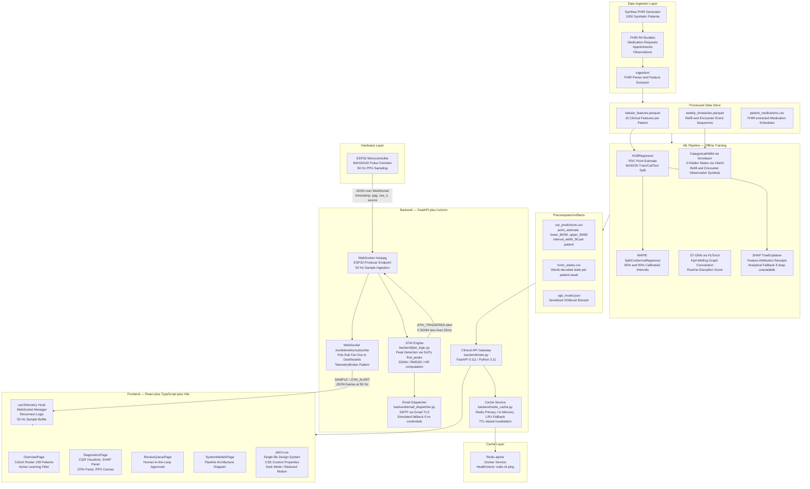
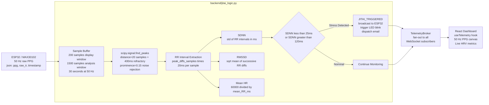
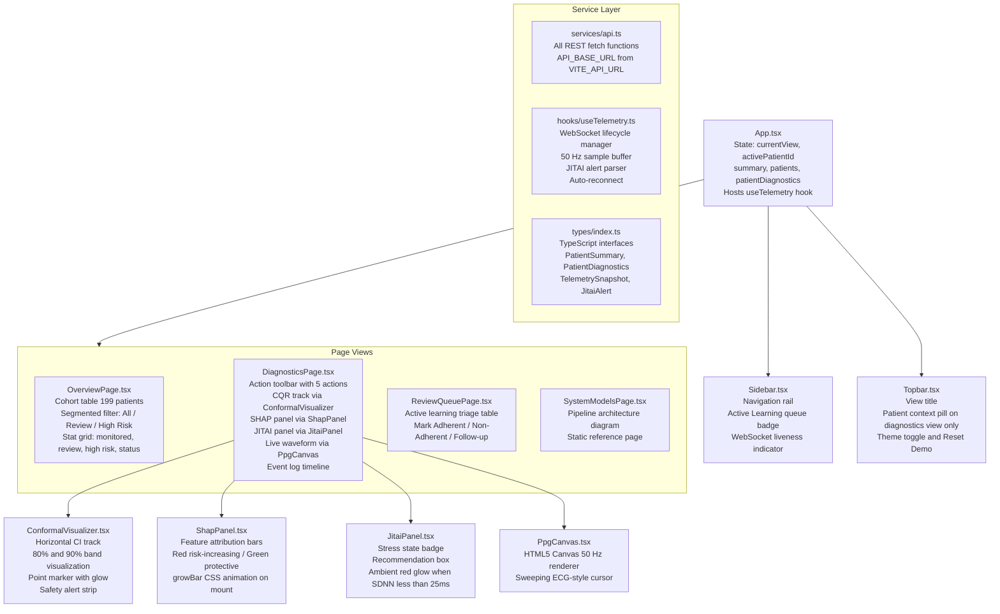
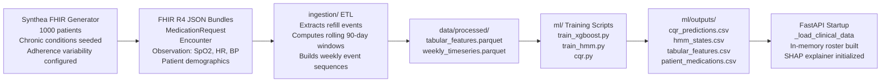

# Awarely — Indirect-Signal Medication Adherence Intelligence Platform

**🔴 Live Demo:** [https://awarely-iota.vercel.app](https://awarely-iota.vercel.app)

A full-stack clinical decision support system that infers medication non-adherence from indirect signals — pharmacy refill records, appointment history, and real-time biosignal telemetry — without relying on patient self-report. Developed for the Manipal Institute of Technology Hackathon 2026.

---

## Table of Contents

1. [Problem Statement](#problem-statement)
2. [System Architecture](#system-architecture)
3. [ML Pipeline](#ml-pipeline)
4. [Real-Time Telemetry and JITAI Engine](#real-time-telemetry-and-jitai-engine)
5. [Backend API Reference](#backend-api-reference)
6. [Frontend Architecture](#frontend-architecture)
7. [Hardware Integration](#hardware-integration)
8. [Data Pipeline](#data-pipeline)
9. [Deployment](#deployment)
10. [Directory Structure](#directory-structure)
11. [Environment Variables](#environment-variables)

---

## Key Highlight: Cloud-Native IoT Telemetry

A core feature of the Awarely architecture is its fully decoupled, cloud-native hardware integration. The system supports remote physiological monitoring via an ESP32 microcontroller that streams high-frequency Photoplethysmography (PPG) data directly to the cloud backend over secure WebSockets (WSS). This permits true remote patient monitoring—clinical staff can view live physiological streams on the dashboard from any device, anywhere in the world, while the patient hardware operates completely autonomously on a standard WiFi connection. Evaluators deploying their own ESP32 hardware can easily configure the device for their local network by modifying the `WIFI_SSID` and `WIFI_PASS` constants at **lines 11 and 12** in `firmware/src/main.cpp`.

## Problem Statement

A patient may be prescribed the right medication, yet treatment can fail because doses are missed, taken at the wrong time, or stopped altogether. In practice, clinicians often have very little visibility into what happens between prescription and the next appointment. Pharmacy refills, prescription changes, symptom patterns, wearable data, and follow-up records may each reveal small clues, but these signals are rarely considered together. The challenge is especially difficult when non-adherence is intermittent rather than a complete abandonment of treatment. Design a system that can identify patterns suggesting medication non-adherence from indirect, routinely available healthcare signals. Rather than relying on patients to manually report every missed dose, the system should reason from changes and inconsistencies across available information, distinguish temporary irregularities from meaningful patterns, and communicate uncertainty clearly. The goal is to help healthcare professionals identify when a treatment may not be working because of how it is being taken, without automatically assuming that a patient is non-compliant.

---

## System Architecture



---

## ML Pipeline

### Feature Engineering

Features are derived exclusively from Synthea-generated FHIR R4 bundles. No raw clinical notes are used. The 15-feature tabular vector per patient covers four domains:

| Domain | Features |
|---|---|
| Refill Behavior | `days_since_last_refill`, `avg_refill_gap_90d`, `refill_gap_std`, `total_refills_90d` |
| Appointment Adherence | `missed_appointments_90d`, `kept_appointments_90d`, `appointment_streak` |
| Physiological Baseline | `spo2_avg_7d`, `rolling_7d_avg_hr`, `sbp_avg` |
| Demographic / Therapy | `age`, `gender`, `medication_count`, `days_on_therapy`, `insurance_type_enc` |

### XGBoost Regressor

**Target variable:** Proportion of Days Covered (PDC) — a continuous adherence score in [0, 1].

**Architecture:** `XGBRegressor(max_depth=6, n_estimators=200, learning_rate=0.05, objective="reg:squarederror")`.

**Data split:** 60% training / 20% calibration / 20% test. Calibration and test sets are saved as `.parquet` for downstream CQR conformalization.

**Serialization:** `ml/models/xgb_model.json` (XGBoost native JSON format).

### Conformal Quantile Regression (CQR)

The raw XGBoost point estimate is wrapped by two independent `MAPIE SplitConformalRegressor` instances (80% and 90% confidence levels) using the 20% calibration set. MAPIE's `predict_interval()` returns bounds with shape `(n_samples, 2, 1)`.

**Review trigger logic (evaluated on raw, pre-clipped values):**

- **High Epistemic Uncertainty:** `interval_width_90 > 0.40` — the model's 90% CI spans more than 40 percentage points, indicating distributional uncertainty exceeding clinical acceptability.
- **Out-of-Bounds Extrapolation:** `point_estimate < -0.05 or point_estimate > 1.05` — regression output escaped physical bounds. A 5% tolerance is applied to absorb floating-point noise (e.g. 1.0022 is not a true failure).

When either trigger fires, the patient is flagged `requires_human_review: true` and routed to the Active Learning review queue.

**Coverage verification:** After conformalization, empirical coverage is computed and logged against the nominal 80% and 90% targets.

### Hidden Markov Model (HMM)

**Observation encoding:** Weekly events are encoded into a 4-symbol alphabet:

| Symbol | Meaning |
|---|---|
| 0 | No refill, no appointment |
| 1 | Refill only |
| 2 | Appointment only |
| 3 | Both refill and appointment |

**Architecture:** `CategoricalHMM(n_components=3, n_iter=100)` from `hmmlearn`. Three hidden states represent underlying adherence regimes. Training uses the Baum-Welch algorithm (Expectation-Maximization).

**Decoding:** Viterbi algorithm decodes the most probable state sequence per patient. The final (most recent) decoded state is indexed at startup from `hmm_states.csv`.

**State labels exposed via API:**
- State 0 — Stable Routine
- State 1 — Variable Pattern
- State 2 — Volatile Phase

### SHAP Explainability

`ml/shap_explainer.py` wraps `shap.TreeExplainer` around the XGBoost booster. It produces per-patient feature attribution receipts that the frontend renders as directional impact bars.

**Resilient fallback:** If the `shap` package is unavailable in the runtime environment, an analytical attribution approximation is computed using XGBoost's native `feature_importances_` scores weighted by normalized feature deviation from clinical baseline values. The API gateway never errors regardless of whether `shap` is installed.

**Contract:** `generate_shap_receipt(patient_features: dict) -> dict` — returns `base_value` plus `{feature}_impact` float keys for all 15 features.

### Spatio-Temporal Graph Neural Network (ST-GNN)

`ml/st_gnn.py` implements a Kipf-Welling graph convolution layer over a 4-node mobility graph (`[Home, Work, Pharmacy, Clinic]`). Node features encode visit frequency, dwell duration, schedule variance, and time deviation over a 7-day rolling window. The network computes a scalar `routine_disruption_score` in [0, 1]. This module is available as a supplementary feature channel.

---

## Real-Time Telemetry and JITAI Engine

### Signal Processing Pipeline



**Evaluation cadence:** HRV metrics are computed every 100 samples (2 seconds at 50 Hz) using the 1500-sample rolling analysis buffer.

**Stress thresholds:**
- `SDNN < 25ms` — low autonomic variability, sympathetic hyperactivation
- `SDNN > 120ms` — erratic arrhythmic variance

**JITAI cooldown:** `JITAI_COOLDOWN_SECONDS = 240`. The system enforces a per-patient 4-minute cooldown to prevent alert flooding. Manual REST triggers (`/trigger-reminder`) bypass the cooldown for demonstration purposes.

### TelemetryBroker

`TelemetryBroker` decouples the ESP32 producer WebSocket (`/ws/ppg`) from any number of React dashboard subscribers (`/ws/telemetry/subscribe`). Subscribers are fully isolated from hardware — they cannot interfere with the 50 Hz producer loop. Dead subscriber connections are detected on the next broadcast attempt and removed from the subscriber list.

---

## Backend API Reference

Base URL: `http://localhost:8000`

### REST Endpoints

| Method | Path | Description |
|---|---|---|
| `GET` | `/api/patients` | Cohort roster with `requires_review`, `status`, `limit` filter params |
| `GET` | `/api/patients/summary` | Cohort-level aggregate statistics and model health flags |
| `GET` | `/api/patient/{id}/adherence` | Full diagnostic record: CQR intervals, HMM state, SHAP receipt, review flag |
| `GET` | `/api/telemetry/latest` | REST snapshot of the latest buffered PPG and HRV metrics |
| `GET` | `/api/health` | Operational health: model artifact presence, cache mode, active model flags |
| `POST` | `/api/patients/{id}/adherence-review` | Submit active learning label: `{"status": "adherent" or "non_adherent"}` |
| `POST` | `/api/patients/{id}/follow-up` | Schedule follow-up and dispatch follow-up email |
| `POST` | `/api/patients/{id}/trigger-reminder` | Manually trigger JITAI stress reminder email (bypasses cooldown) |
| `POST` | `/api/patients/{id}/remind-refill` | Dispatch medication refill reminder email |
| `POST` | `/api/patients/{id}/remind-appointment` | Dispatch missed appointment reminder email |
| `POST` | `/api/patients/{id}/force-stress` | Force a simulated patient into stress state for demonstration |
| `POST` | `/api/reset` | Reset in-memory patient list to original startup state |

### WebSocket Endpoints

| Path | Role | Direction | Frame Schema |
|---|---|---|---|
| `/ws/ppg` | ESP32 producer | Bidirectional | Inbound: `{timestamp, ppg, raw_ir, source}`. Outbound: JITAI alert JSON |
| `/ws/telemetry/subscribe` | Dashboard client | Receive-only | `{type: "SAMPLE"}` / `{type: "JITAI_ALERT"}` / `{type: "SNAPSHOT"}` |
| `/ws/simulated/{patient_id}` | Simulated patient | Send-only | 50 Hz synthetic PPG for patients not connected via hardware |

### Caching

`backend/redis_cache.py` implements a `CacheService` singleton with:
- **Primary:** Redis at `REDIS_URL`. Connection uses `socket_timeout=1.0` to fail fast on unavailability.
- **Fallback:** Thread-safe `InMemoryLRUCache` with `capacity=1000` entries and TTL eviction. Uses `OrderedDict` for O(1) LRU promotion.
- **Invalidation:** Adherence cache key `adherence:{patient_id}` is explicitly deleted after any clinician action to force fresh computation on the next request.

---

## Frontend Architecture

The frontend is a single-page application built with React 18, TypeScript, and Vite. It is served in production by nginx on port 5173.

### Component Tree



### Design System

All styling lives in a single file: `frontend/src/styles/stitch.css` (1,848 lines). No Tailwind, no CSS-in-JS, no utility frameworks. The system uses CSS custom properties exclusively.

**Token categories:** Surfaces, Borders, Typography (`--font-sans`, `--font-mono`, `--fs-display` through `--fs-metric`), Spacing (`--sp-1` at 4px through `--sp-7` at 48px), Radius (`--r-xs` through `--r-pill`), Elevation (`--shadow-1`, `--shadow-2`, `--elev-1`), and Clinical status (`--status-healthy`, `--status-warn`, `--status-critical`, `--status-info` with glow and dim variants).

Dark mode overrides are scoped to `[data-theme='dark']`. All keyframe animations are wrapped in a `prefers-reduced-motion` block.

---

## Hardware Integration

**Firmware:** `firmware/src/main.cpp` — compiled with PlatformIO.

**Libraries:** `WebSocketsClient`, `ArduinoJson`, `MAX30105` (SparkFun), `WiFi`, `Wire`.

**Dual-mode operation:**

- **Mode A — Physical sensor:** Probes I2C address `0x57` (MAX30102) at boot. If found, configures for `LED brightness=60, sample average=4, mode=2 (Red+IR), sample rate=100Hz, pulse width=411µs, ADC range=4096`. Finger contact is detected by IR threshold (`raw_ir > 50,000`). DC component is removed with a first-order IIR high-pass: `dc_filter = 0.95 × dc_filter + 0.05 × raw_ir`. AC-coupled signal normalized as `ppg_val = (raw_ir - dc_filter) / 1500`.

- **Mode B — Synthetic fallback:** If sensor is absent or `FORCE_SIMULATION=true`, generates a physiologically realistic waveform at 50 Hz: `ppg = sin(2πt × 1.2) + 0.35×sin(4πt × 1.2 + 0.5) + noise`. The 1.2 Hz fundamental corresponds to 72 BPM. The second harmonic at 2.4 Hz simulates the dicrotic notch.

**Closed-loop JITAI:** The firmware listens for incoming WebSocket messages. When `{"alert": "JITAI_TRIGGERED"}` is received, GPIO 2 (onboard LED) blinks for 80ms as a physical intervention cue.

**Reconnect policy:** Automatic WebSocket reconnection every 3 seconds on disconnect via `webSocket.setReconnectInterval(3000)`.

---

## Data Pipeline



Patient medications are extracted directly from Synthea FHIR `MedicationRequest` resources — not synthesized from random drug pools — ensuring medication names and dosing schedules reflect the FHIR-modeled clinical context.

---

## Cloud Architecture & Hosting

The application is deployed using a decoupled, serverless microservice architecture to ensure high availability and scalable WebSocket connections.

### 1. Frontend (Vercel)
The React/Vite frontend is continuously deployed on **Vercel** via GitHub integration. Vercel's Edge Network serves the static assets and provides automatic SSL termination.
- **Environment Variables**: 
  - `VITE_API_URL` -> Points to the Google Cloud Run backend REST URL.
  - `VITE_WS_URL` -> Points to the secure `wss://` Google Cloud Run WebSocket URL.

### 2. Backend (Google Cloud Run)
The FastAPI backend and machine learning inference engine are containerized and deployed on **Google Cloud Run**.
- **Continuous Deployment**: Connected directly to the GitHub repository using GCP Cloud Build. Upon every push to the `main` branch, Cloud Build compiles the Docker image and pushes it to **Artifact Registry**, which automatically provisions a new Cloud Run revision.
- **Concurrency**: Configured to support up to 80 concurrent requests per container to maintain stable 50Hz WebSocket streams for the hardware integration.
- **Stateless ML Models**: The XGBoost and HMM models are pre-trained, pickled, and embedded directly into the Docker container. 

### 3. Edge Hardware (ESP32)
The ESP32 microcontroller (utilizing an HW-605 / MAX30102 sensor) is flashed via PlatformIO. 
- It establishes a direct TLS encrypted `wss://` WebSocket connection to the Cloud Run backend.
- It operates at a stable I2C standard speed (100kHz) and streams raw PPG buffers at an effective 50Hz.
- Includes automatic fallback to simulated synthetic waveform generation if the physical I2C sensor is disconnected.

---

### Local Development Quick Start

### Docker Build Configurations (Local vs. Cloud)

Because the backend relies on heavy ML packages (XGBoost, SciKit), the pip cache can become massive. You must use the correct `backend/Dockerfile` depending on your environment.

**Version 1: Local Development (Default in repo)**
Uses BuildKit cache mounts to prevent re-downloading massive files when rebuilding your container locally.
```dockerfile
# backend/Dockerfile (Local version)
COPY requirements.txt .
RUN --mount=type=cache,target=/root/.cache/pip pip install -r requirements.txt
RUN --mount=type=cache,target=/root/.cache/pip pip install redis
```

**Version 2: Cloud Deployment (e.g., Render Free Tier)**
Free cloud tiers have tight RAM/Disk limits (often 512MB). The local cache mounts will cause the server to crash (`BrokenPipeError`) during deployment. You must strip the cache mounts and use `--no-cache-dir`.
```dockerfile
# backend/Dockerfile (Cloud version)
COPY requirements.txt .
RUN pip install --no-cache-dir -r requirements.txt
RUN pip install --no-cache-dir redis
```

### Updating the Backend Without Rebuilding

```bash
docker cp backend/main.py vanishing_dose_backend:/app/backend/main.py
docker-compose restart backend
```

### Rebuilding the Frontend

```bash
docker-compose build frontend && docker-compose up -d frontend
```

### ESP32 Firmware

Open `firmware/` in VSCode with the PlatformIO extension. Set `WS_HOST` in `main.cpp` to your machine's LAN IP. Flash via `pio run --target upload`. For Wokwi simulation, use the included `diagram.json`.

---

## Directory Structure

```
.
├── backend/
│   ├── main.py                 # FastAPI application, WebSocket endpoints, ML inference
│   ├── jitai_logic.py          # HRV computation: SDNN, RMSSD, peak detection
│   ├── redis_cache.py          # CacheService with Redis primary / LRU fallback
│   ├── email_dispatcher.py     # SMTP dispatch for JITAI and clinical actions
│   ├── synthetic_ppg.py        # Ornstein-Uhlenbeck PPG simulator
│   ├── ppg_simulator.py        # PatientSimulator wrapper
│   └── Dockerfile
├── ml/
│   ├── train_xgboost.py        # XGBRegressor training, 60/20/20 split
│   ├── cqr.py                  # MAPIE SplitConformalRegressor at 80% and 90%
│   ├── train_hmm.py            # CategoricalHMM training, Viterbi decoding
│   ├── shap_explainer.py       # TreeExplainer with analytical fallback
│   ├── st_gnn.py               # Spatio-temporal GNN, mobility routine disruption
│   ├── nlp_sdoh.py             # NLP extraction of social determinants of health
│   ├── models/                 # xgb_model.json, hmm_model.pkl
│   └── outputs/                # cqr_predictions.csv, hmm_states.csv, tabular_features.csv
├── frontend/
│   ├── src/
│   │   ├── App.tsx                # Root component, global state, data fetching
│   │   ├── types/index.ts         # TypeScript interfaces (source of truth)
│   │   ├── services/api.ts        # REST fetch functions
│   │   ├── hooks/useTelemetry.ts  # WebSocket manager, 50 Hz buffer
│   │   ├── components/            # Sidebar, Topbar, ConformalVisualizer, ShapPanel, JitaiPanel, PpgCanvas
│   │   ├── pages/                 # OverviewPage, DiagnosticsPage, ReviewQueuePage, SystemModelsPage
│   │   ├── lib/clinicalLabels.ts  # Label translation utilities
│   │   └── styles/stitch.css      # Complete design system
│   ├── index.html
│   └── Dockerfile
├── firmware/
│   └── src/main.cpp            # ESP32 dual-mode firmware
├── ingestion/                   # FHIR ETL scripts
├── data/
│   ├── processed/               # tabular_features.parquet, weekly_timeseries.parquet
│   └── calibration/             # calibration_set.parquet, test_set.parquet
├── tests/
├── docker-compose.yml
└── requirements.txt
```

---

## Environment Variables

| Variable | Default | Description |
|---|---|---|
| `REDIS_URL` | `redis://localhost:6379` | Redis connection string. Use `redis://redis:6379` inside Docker. |
| `CORS_ORIGINS` | `http://localhost:5173,...` | Comma-separated allowed CORS origins. |
| `SMTP_USER` | — | Gmail address for outgoing clinical emails. |
| `SMTP_PASSWORD` | — | Gmail app password. Spaces are stripped automatically. |
| `TARGET_EMAIL` | — | Recipient address for all dispatched clinical notifications. |
| `VITE_API_URL` | `http://localhost:8000` | Frontend REST base URL (build-time Vite env). |
| `VITE_WS_URL` | `ws://localhost:8000` | Frontend WebSocket base URL (build-time Vite env). |

If SMTP credentials are absent, the email dispatcher falls back to simulated mode. The email body is logged to `sent_emails.log` and returned in the API response without delivery.
