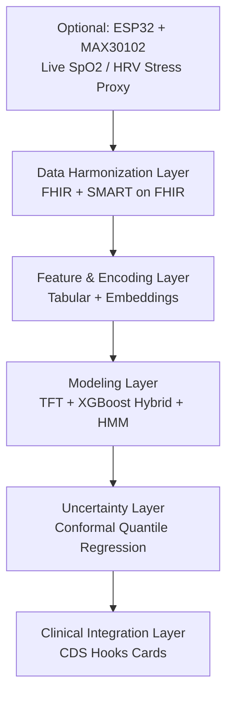

# The Vanishing Dose
### An Indirect-Signal Medication Non-Adherence Detection System

---

## 1. Problem Statement

Medication non-adherence is typically detected through self-report or after a treatment has already failed — by which point a clinician may escalate a dose or switch therapies based on a false signal ("the drug isn't working") rather than the true cause ("the patient isn't taking it"). Self-report is unreliable, and most clinical workflows have no systematic way to infer adherence from the data that is already being collected passively: refill timing, appointment attendance, and physiological trends.

**The Vanishing Dose** is designed to close that gap — inferring medication non-adherence indirectly from routine healthcare data (refill patterns, encounter history, vitals) rather than relying on the patient to report it. Three problems have to be solved for this to be trustworthy rather than merely clever:

1. **Uncalibrated overconfidence** — a model that outputs a single adherence score without any sense of how reliable that score is.
2. **Algorithmic bias** — features that look predictive but are really proxies for income, race, or access to transportation.
3. **Alert fatigue** — even a correct signal is useless if it's delivered in a way clinicians learn to ignore.

The architecture and mitigation plan below address each of these directly, and are scoped realistically for a hackathon/student build rather than a production hospital deployment.

---

## 2. System Architecture

### 2.1 Layer Overview

### 2.2 Layer 0 (Optional) — Supplementary Live Vitals Hardware

- **Purpose:** a live demo prop that supplies real-time SpO2 and a stress proxy, layered *on top of* the core refill/encounter-based adherence model — not a replacement for it. The system's primary signal remains indirect (refill gaps, encounter history); this layer only adds a physiological corroborating signal where available.
- **Hardware:** ESP32 microcontroller + MAX30102 pulse-oximeter/heart-rate sensor (I2C), using the SparkFun MAX3010x library for SpO2 and BPM output.
- **Derived signal:** the MAX30102's raw PPG waveform is used to compute beat-to-beat intervals → HRV (RMSSD) → a stress-proxy score, alongside the direct SpO2 reading.
- **Transport:** ESP32 built-in WiFi → MQTT or HTTP POST → ingested by the Layer 1 FastAPI gateway and formatted as a FHIR `Observation` resource, so it slots into the existing harmonization pipeline without a separate code path.
- **Note for the pitch:** state explicitly that SpO2/HRV-derived stress is a supplementary, optional signal — this keeps the project framed as an indirect-signal adherence system rather than a general-purpose vitals monitor.

### 2.3 Layer 1 — Data Harmonization

- **Standard:** HL7 FHIR as the common resource model (`Patient`, `Observation`, `MedicationRequest`, `MedicationDispense`, `MedicationAdministration`, `Condition`, `Encounter`)
- **Pattern:** an API gateway / facade ingests heterogeneous sources (EHR exports, pharmacy refill feeds, wearable streams) and normalizes them into FHIR JSON
- **Auth:** SMART on FHIR for unified access control across sources
- **Sources:**
  - MIMIC-IV Clinical Database Demo on FHIR (100-patient, no credentialing required, real timestamped meds/vitals/labs)
  - EHRSHOT (6,739 patients, 41M+ timestamped events — volume for training)
  - Synthea (unlimited synthetic patients, generates refill gaps, vitals, and missed appointments on demand)

### 2.4 Layer 2 — Feature & Encoding

- Structured codes only (ICD for diagnoses, RxNorm/NDC for medications) — no NLP needed, since FHIR demo data excludes free text
- Two parallel encodings:
  - **Tabular (for XGBoost):** engineered features such as `days_since_last_refill`, `missed_appointments_90d`, `rolling_7d_avg_heart_rate`
  - **Embeddings (for TFT):** learned vector representations of diagnosis/medication codes, so the transformer can associate drug ↔ condition relationships

### 2.5 Layer 3 — Modeling: TFT + XGBoost Hybrid

- **Temporal Fusion Transformer (TFT):** ingests the raw irregular timeline (static demographics + known inputs + historical time series); self-attention captures long-range dependencies; gating layers surface which features drove a given prediction
- **XGBoost meta-learner:** stacked on top of the TFT, takes TFT outputs plus tabular features, corrects residuals, and produces the final risk score
- **Hidden Markov Model layer:** reframes adherence as a spectrum of latent states — *Strictly Adherent → Intermittent → Non-Adherent* — instead of a binary label. This is what distinguishes "skipped two days" from genuine non-adherence, without over-flagging normal variation
- *Stretch alternatives considered:* TabNet, FT-Transformer, PFN-Boost

### 2.6 Layer 4 — Uncertainty: Conformal Quantile Regression (CQR)

- Outputs a calibrated confidence interval instead of a deterministic label (e.g., "adherence estimate: 88–94%")
- Wider intervals appear automatically for underrepresented or high-volatility subgroups, so the system defers to a clinician rather than issuing a confident but biased call — this is the direct technical answer to the algorithmic-bias problem

### 2.7 Layer 5 — Clinical Integration: CDS Hooks

- No standalone dashboard, no interruptive pop-ups
- **Information Cards:** a passive adherence trend shown when a clinician opens a chart
- **Suggestion Cards:** a contextual nudge if a clinician tries to escalate a dose (e.g., "possible missed doses, not treatment failure")

### 2.8 Proposed Tech Stack

| Layer | Tools |
|---|---|
| Supplementary hardware (optional) | ESP32 + MAX30102 (SparkFun MAX3010x library), WiFi → MQTT/HTTP |
| Ingestion / Harmonization | FHIR, SMART on FHIR, FastAPI gateway |
| Storage | Parquet/Postgres, NDJSON for FHIR resources |
| Sequence model | PyTorch + PyTorch Forecasting (TFT), trained on Colab T4 |
| Tabular model | XGBoost (local, CPU) |
| Latent state model | hmmlearn (HMM) |
| Uncertainty | MAPIE or crepes (conformal prediction) |
| Clinical UI | CDS Hooks sandbox + lightweight Streamlit/React demo dashboard |
| Datasets | MIMIC-IV Demo on FHIR, EHRSHOT, Synthea |

### 2.9 Pipeline Narrative

1. (Optional) ESP32 + MAX30102 streams live SpO2/PPG over WiFi → formatted as a FHIR `Observation`
2. Harmonize multi-source data into FHIR
3. Extract tabular CSV + time-series tensors in parallel
4. Pre-train TFT on Colab overnight → export weights
5. Train XGBoost meta-learner locally on TFT outputs (seconds)
6. HMM converts risk score into an adherence state
7. CQR wraps the state in a confidence interval
8. Surface via CDS Hooks Cards in a demo EHR sandbox

---

## 3. Feasibility & Risk Mitigation

Each of the three core risks has a version that's realistic to actually build for a hackathon/student project, and a version that would require a hospital deployment. The plan below scopes to the former.

### 3.1 Fixing Uncalibrated Overconfidence

- **Use adherence-shaped data, not ICU data.** Pull refill-gap data from Mendeley's adherence datasets or the MIMIC-IV Demo's pharmacy/medication tables — not vitals. If Synthea is the fallback, run it long enough (simulate years) that refill patterns look realistic, and state plainly in the writeup: *"calibrated on synthetic data, not validated on real refill behavior."*
- **Pick one concrete definition of "adherence" and stick to it.** The simplest for a hackathon: `days_covered / days_in_period` — Proportion of Days Covered (PDC), a real clinical metric. Build the CQR interval around predicting that number, not a vague "adherence score."
- **Actually test calibration.** Split data into train/calibration/test. After training, check: of all patients where the model predicted a "70–90% confidence interval," did the true value fall inside that range roughly 70–90% of the time? A simple plot of predicted intervals vs. actual outcomes is enough to demonstrate this at demo time — the difference between "we used CQR" and "we validated CQR."
- **Drop "recalibrate as insurance rules change" as a build target.** State it as a known limitation / future work item rather than attempting to build it.

### 3.2 Fixing Bias

- **Manually audit for proxy variables before training.** List every feature going into the model (pharmacy-switch count, zip code, insurance type, refill gap) and ask: *could this be standing in for income, race, or transportation access instead of measuring pill-taking?* Pharmacy-switch frequency and zip code are the two classic offenders — consider dropping them or treating them separately.
- **Run a simple subgroup check, not a full fairness framework.** Split predictions by whatever demographic field the dataset has (insurance type is a reasonable proxy if race data isn't available) and compare error rate or interval width across groups. A basic bar chart of "average predicted adherence by subgroup" is enough to show the check was done.
- **Reframe sparse data as a flag, not a verdict.** If a patient's refill history is too sparse to trust, output *"insufficient data — needs clinician review"* instead of *"non-adherent."* This one-line change to the output logic is more honest bias mitigation than any amount of CQR math.

### 3.3 Fixing Alert Fatigue

- **Don't attempt a real EHR integration.** No hospital will approve a student CDS Hooks integration in a matter of weeks. Instead, **simulate it**: a mock "EHR chart view" web page that displays the adherence card the way it would appear inside Epic, using the real CDS Hooks Card JSON format. This demonstrates command of the standard without requiring vendor approval.
- **Design the trigger logic on paper first.** Explicitly decide: does the card show on every chart open (risk: annoying), or only when adherence risk crosses a threshold (better)? Document and defend the chosen rule — this is the actual "prevent alert fatigue" work, and it costs an hour rather than a hospital contract.
- **Be upfront in the pitch.** State clearly: *"This is a working prototype of the CDS Hooks Card format; production deployment requires EHR vendor certification, which is out of scope for this project."* This framing is more credible to judges than an implied "it's basically done."

### 3.4 The General Principle

For each of the three risks, the honest move is to replace *"we used X"* with *"we used X, and here's the one concrete check that shows it actually works"* — a calibration plot, a subgroup comparison chart, a mock CDS card. That single substitution is the difference between a demo that merely sounds impressive and one that survives a judge asking, "wait, how do you know that interval is right?"

---

## 4. Roadmap

| Phase | Milestone |
|---|---|
| 0 (Optional) | Build ESP32 + MAX30102 rig; stream SpO2/HRV as a FHIR `Observation` |
| 1 | Harmonize MIMIC-IV Demo, EHRSHOT, and Synthea data into FHIR resources |
| 2 | Build tabular + embedding feature pipelines; define PDC as the adherence target |
| 3 | Pre-train TFT (Colab), train XGBoost meta-learner, layer in HMM adherence states |
| 4 | Wrap outputs in CQR; validate calibration with train/calibration/test split |
| 5 | Manual proxy-variable audit + subgroup fairness check with visualizations |
| 6 | Build mock EHR chart view rendering real CDS Hooks Card JSON |
| 7 | Assemble demo narrative: architecture walkthrough, calibration plot, subgroup chart, mock CDS card |

---

## 5. Summary

The Vanishing Dose infers medication non-adherence from routine healthcare data using a TFT + XGBoost hybrid with an HMM adherence-state layer, wraps its output in calibrated confidence intervals via conformal quantile regression, and surfaces findings to clinicians through non-interruptive CDS Hooks cards rather than a standalone dashboard. An optional ESP32 + MAX30102 rig can supply a live SpO2/HRV-derived stress signal as a demo prop, feeding into the same FHIR pipeline as a supplementary — not primary — signal. The mitigation plan for overconfidence, bias, and alert fatigue is deliberately scoped to what a hackathon or student team can validate and demonstrate — favoring honest, checked claims over polished but unverified ones.
